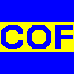

# COF - Coretôr Ortografic Furlan

<div align="center">
  
  <br>
  <em>Original Friulian Spell Checker</em>
</div>

## Overview

**COF** (Coretôr Ortografic Furlan) is the original Friulian spell checker developed by Franz Feregot. This is the reference implementation written in Perl, serving as the authoritative source for the Friulian language spell checking algorithm and dictionary management.

> **⚠️ Important Notice**: This repository contains the original, unmodified COF source code that should be preserved as-is for historical and reference purposes. Any modifications should be made in derivative projects, not in this original codebase.

## Project History

This repository represents version **2.16** of COF, built on **20110620** with lemmas version **20150417**. The software includes both a graphical user interface and command-line tools for Friulian spell checking.

### Branch Structure

- **`master`**: Main branch with original COF source code + accepted changes from develop (🔒 **protected** - requires pull requests for merges)
- **`original`**: Pure original source with preservation notice (🔒 **locked** - completely read-only, historical reference)
- **`develop`**: Active development branch for new features and improvements (🔓 **open for development**)

> **Note**: The `original` branch contains only the unmodified original COF code and is completely locked for historical preservation. The `master` branch evolves by accepting vetted changes from `develop` through pull requests. All active development work should be done in the `develop` branch.

### Repository Structure

This repository preserves Franz Feregot's original COF implementation with modern enhancements. See `CHANGELOG.md` for detailed version history.

**Original Structure** (preserved in `original` branch):
- Complete Perl implementation in `COF-2.16/`
- Core spell checking modules in `lib/COF/`
- GUI and CLI executables in `script/`
- OpenOffice.org plugin integration
- Resource files and original icons
- Empty dictionary placeholder (`dict/empty`)
- Build configuration and metadata

**Enhancements Added**:
- Complete Friulian dictionary database with Git LFS
- Comprehensive test suite with 76 validation cases
- Documentation and contribution guidelines
- Repository modernization and GitHub integration
- Continuous Integration with automated testing on every commit

## Architecture

### Compatibility Solutions

**⚠️ DB_File Dependency Issue**: The original COF implementation depends on BerkeleyDB through Perl's `DB_File` module. On some systems (especially Windows with Strawberry Perl), this dependency may not be available or properly configured.

**Solution: COF::DataCompat**
We provide `COF::DataCompat` - a fully compatible alternative to `COF::Data` that:
- ✅ **Complete phonetic algorithm**: Identical `phalg_furlan` implementation (100% compatibility)
- ✅ **No BerkeleyDB dependency**: Uses SDBM_File (included in standard Perl)
- ✅ **Drop-in replacement**: Same API as `COF::Data` for phonetic functions
- ⚠️ **Limited dictionary features**: Database operations are restricted but phonetic algorithm works fully

**Usage**:
```perl
# Instead of: use COF::Data;
use COF::DataCompat;

# Phonetic algorithm works identically
my ($primo, $secondo) = COF::DataCompat::phalg_furlan('furlan');
# Returns: ('fYl65', 'fYl65')

# Object creation (with limitations)
my $data = COF::DataCompat->new(
    words_ph => 'dict/words.db',
    words_rt => 'dict/words.rt'
);
```

**When to use COF::DataCompat**:
- BerkeleyDB/DB_File installation issues
- Systems without proper Berkeley DB libraries
- When you only need the phonetic algorithm
- Cross-platform compatibility requirements

**Test files available**:
- `test_complete_compat.pl` - Comprehensive compatibility tests
- `tests/test_core_functionality_compat.pl` - Core functionality with compat version
- `util/spellchecker_utils_compat.pl` - Compatible utilities

### Core Components

1. **COF::App** - Main application entry point with Wx GUI framework
2. **COF::Data** - Dictionary and language data management
3. **COF::SpellChecker** - Core spell checking logic
4. **COF::FastChecker** - Text processing and error detection engine  
5. **COF::RadixTree** - Efficient dictionary storage and lookup
6. **COF::Letters** - Friulian character set definitions
7. **COF::Frame** - Main GUI window and user interface

### Key Features

#### 1. Phonetic Algorithm (`phalg_furlan`)
The heart of COF's spell checking is a sophisticated phonetic algorithm located in `COF::Data::phalg_furlan` that:

- Generates dual phonetic hashes (primo/secondo) for Friulian words
- Normalizes accented characters (à/á/â → a, è/é/ê → e, etc.)
- Handles Friulian-specific sequences (çi/çe, sci/sce, cj patterns)
- Implements complex vowel and consonant transformations
- Supports phonetic similarity matching for suggestions

**Algorithm Flow:**
```perl
Input: "sciençe" 
  → Preparation: normalize accents, handle ç sequences, compress doubles
  → Hash Generation: apply different rules to primo/secondo hashes  
  → Vowel Mapping: diphthongs first (ai→6, ei→7), then singles (a→6, e→7)
  → Consonant Mapping: context-sensitive transformations (^t→H, ^d→I)
Output: ("A75ç7", "E775ç7")
```

#### 2. Dictionary System
- **System Dictionary**: Core Friulian vocabulary stored in RadixTree format
- **User Dictionary**: Personal additions with phonetic indexing
- **Exception Dictionary**: Words that override default rules
- **Frequency Dictionary**: Usage statistics for word ranking

#### 3. Text Processing
- **Word Iterator**: Tokenizes text respecting Friulian word boundaries
- **Context Analysis**: Considers surrounding words for better suggestions
- **Automatic Correction**: Learns from user corrections

#### 4. Suggestion Engine
- **Phonetic Matching**: Uses dual hash system for sound-alike words
- **Edit Distance**: Levenshtein distance with Friulian-specific costs
- **Frequency Ranking**: Prioritizes common words in suggestions

## Installation & Setup on Windows

### Prerequisites

**1. Install Git LFS** (required for dictionary files):
```powershell
# Git LFS is included with modern Git installations
# Verify installation
git lfs version

# If not installed, download from: https://git-lfs.github.io/
```

**2. Install Strawberry Perl** using Chocolatey:

```powershell
# Install Chocolatey if not already installed
Set-ExecutionPolicy Bypass -Scope Process -Force; 
[System.Net.ServicePointManager]::SecurityProtocol = [System.Net.ServicePointManager]::SecurityProtocol -bor 3072; 
iex ((New-Object System.Net.WebClient).DownloadString('https://community.chocolatey.org/install.ps1'))

# Install Strawberry Perl
choco install strawberryperl

# Refresh environment variables
refreshenv
# OR restart PowerShell session
```

### Install Dependencies

```powershell
# Navigate to COF directory
cd "path\to\COF"

# Install required Perl modules
cpan install Params::Validate
cpan install File::HomeDir  
cpan install Wx
cpan install Wx::Perl::ListCtrl
cpan install Try::Tiny
cpan install Carp::Always
```

### Clone Repository with LFS

```powershell
# Clone repository and download LFS files
git clone https://github.com/daurmax/COF.git
cd COF
git lfs install
git lfs pull
```

### Build and Run

```powershell
# Build the project
perl Build.PL
perl Build

# Run phonetic algorithm tests
perl tests/test_phonetic_perl.pl

# Launch GUI application
perl script/cof.pl

# Use CLI version
perl script/cof_oo_cli.pl
```

## Repository Structure

### Original COF Implementation
Franz Feregot's complete COF v2.16 source code (preserved in `original` branch and flattened to repository root):

```
├── lib/COF/                    # Core Perl modules (16 files)
│   ├── Data.pm                 # Dictionary management & phonetic algorithm
│   ├── SpellChecker.pm         # Main spell checking logic
│   ├── FastChecker.pm          # Text processing engine
│   ├── RadixTree.pm            # Dictionary storage structure
│   ├── App.pm                  # GUI application framework
│   ├── Frame.pm, FrameBase.pm  # GUI window management
│   ├── TextDisplay.pm          # Text editing components
│   ├── Personal.pm             # User dictionary management
│   └── [7 additional modules]  # Complete implementation
├── script/                     # Executable scripts
│   ├── cof.pl                  # GUI application launcher
│   └── cof_oo_cli.pl           # Command-line interface
├── COFOOPlugin/                # OpenOffice.org integration
│   ├── cof/oo/                 # Java plugin classes
│   └── [plugin configuration]
├── res/                        # Resources and assets
│   ├── icons/                  # Application icons (.ico format)
│   │   ├── cof128.ico, cof32.ico, cof16.ico
│   │   └── [additional icon variants]
│   ├── Istruzions.chm         # Help documentation
│   └── dr.bmp, dv.bmp         # UI graphics
├── dict/
│   └── empty                   # Placeholder file (dictionaries not included)
├── Build.PL                    # Perl build configuration
├── MANIFEST                    # File manifest
├── META.json, META.yml         # Package metadata
└── cof.bat                     # Windows launcher script
```

### Enhanced Repository (current branch)
Modern additions while preserving original structure in flat hierarchy:

```
├── README.md                   # This documentation
├── CHANGELOG.md                # Version history based on Git tags
├── AGENTS.md                   # Contribution guidelines  
├── .gitattributes              # Git LFS configuration
├── .github/                    # GitHub integration
│   └── copilot-instructions.md # AI assistance guidelines
├── lib/COF/DataCompat.pm       # 🆕 DB_File-free compatible version
├── test_complete_compat.pl     # 🆕 Comprehensive compatibility tests
├── test_data_compat.pl         # 🆕 DataCompat vs Data comparison
└── util/spellchecker_utils_compat.pl  # 🆕 Compatible utilities

### 🔧 Compatibility Files

**Problem**: The original COF depends on BerkeleyDB through Perl's `DB_File` module. On Windows systems with Strawberry Perl, this often fails due to missing or corrupted `DB_File.xs.dll`.

**Solution**: We provide compatibility alternatives that maintain 100% algorithm accuracy:

```
├── lib/COF/DataCompat.pm       # Drop-in replacement for COF::Data
│                               # - Complete phalg_furlan algorithm  
│                               # - Uses SDBM_File (standard Perl)
│                               # - No BerkeleyDB dependency
│                               # - Limited dictionary features
├── tests/test_core_functionality_compat.pl  # Compat version tests
├── test_complete_compat.pl     # Full compatibility test suite
├── test_data_compat.pl         # Side-by-side comparison tests  
└── util/spellchecker_utils_compat.pl  # CLI utilities (compat version)
```

**Key Features of Compatibility Version**:
- ✅ **100% Algorithm Parity**: Identical phonetic results to original
- ✅ **Cross-Platform**: Works on any Perl installation 
- ✅ **Zero Additional Dependencies**: Uses only standard Perl modules
- ⚠️ **Reduced Functionality**: Dictionary operations limited
- 🎯 **Primary Use Case**: Phonetic algorithm integration
├── [original files]            # All COF-2.16 files at root level
├── dict/                       # Enhanced dictionary folder
│   ├── empty                   # Original placeholder (preserved)
│   ├── words.db                # Main dictionary (627MB) [Git LFS]
│   ├── words.rt                # RadixTree index (30MB) [Git LFS]
│   ├── frec.db                 # Frequency data (2.6MB) [Git LFS]
│   ├── elisions.db             # Elision rules (332KB) [Git LFS]
│   └── errors.db               # Error patterns (12KB) [Git LFS]
├── res/icons/
│   ├── [original .ico files]   # Preserved unchanged
│   └── cof128.png              # Converted logo for README
├── tests/                      # Test suite (76 total tests)
│   ├── test_phonetic_perl.pl   # Phonetic algorithm validation (47 tests)
│   ├── test_radix_tree.pl      # RadixTree functionality (9 tests)
│   ├── test_spell_checker.pl   # SpellChecker validation (5 tests) 
│   ├── test_key_value_database.pl # Database lookups (15 tests)
│   └── run_all_tests.pl        # Integrated test runner
├── util/                       # Support utilities (parameterized)
│   ├── spellchecker_utils.pl   # SpellChecker suggestions with CLI options
│   ├── radixtree_utils.pl      # RadixTree suggestions with CLI options
│   ├── encoding_utils.pl       # UTF-8 encoding diagnostics with CLI
│   └── README.md               # Utility documentation and usage examples
├── legacy/                     # Historical reference files
│   ├── 00-contenuto.txt        # Original content description
│   ├── lemis_cof_2015.txt      # Historical word lemmas (24,266 entries)
│   └── peraulis_cof_2015.txt   # Historical vocabulary list (1M+ words)
└── temp/                       # Temporary output files (ignored by git)
```

### Dictionary Database
The original COF distribution included only an `empty` placeholder in `dict/`. This enhanced repository provides the complete Friulian dictionary set (630MB total) managed via Git LFS:

- **words.db** (627MB): Main vocabulary database (~600K words)
- **words.rt** (30MB): RadixTree index for fast prefix matching  
- **frec.db** (2.6MB): Word frequency statistics for suggestion ranking
- **elisions.db** (332KB): Elision and contraction rules
- **errors.db** (12KB): Common spelling error patterns

> 📦 **Git LFS Required**: Dictionary files use Git Large File Storage. Install with: `git lfs install && git lfs pull`

## Testing Framework

The repository includes a comprehensive test suite (76 total tests) validating COF functionality:

### Test Suites

| Test Suite | Tests | Coverage |
|------------|-------|----------|
| **RadixTree (RT_Checker)** | 9 | Word existence, edit-distance suggestions |
| **SpellChecker** | 5 | Word validation, spelling corrections |
| **KeyValueDatabase** | 15 | Database lookups, edge cases |
| **Phonetic Algorithm** | 47 | phalg_furlan hash algorithm validation |

### Test Coverage Areas
- **Basic Functionality**: Word existence checking, suggestion generation
- **Edge Cases**: Empty keys, non-existent entries, invalid inputs
- **Database Integration**: Phonetic, error, frequency, elision lookups
- **Character Handling**: UTF-8 support for Friulian characters (þ)
- **Algorithm Validation**: Edit-distance calculations, ranking systems
- **Edge Cases**: Start-of-word consonants, special endings

```powershell
# Run phonetic tests
perl tests/test_phonetic_perl.pl

# Expected output format:
# word -> ("hash1", "hash2")
# cjatâ -> ("A696", "c7696")
```

## Testing & Validation

The enhanced repository includes comprehensive test coverage to validate the COF implementation:

### Running Tests

```bash
# Run individual test suites:
cd tests
perl test_radix_tree.pl       # RadixTree/RT_Checker functionality (8 tests)
perl test_spell_checker.pl    # SpellChecker word validation (5 tests)  
perl test_key_value_database.pl # Database lookups (8 tests)
perl test_phonetic_perl.pl    # Phonetic algorithm validation (47 tests)

# Run all tests with integrated runner:
perl run_all_tests.pl         # Complete test suite (76 total tests)
```

### Test Coverage

| Test Suite | Tests | Coverage |
|------------|-------|----------|
| **RadixTree (RT_Checker)** | 9 | Word existence, edit-distance suggestions |
| **SpellChecker** | 5 | Word validation, spelling corrections |
| **KeyValueDatabase** | 15 | Database lookups, edge cases |
| **Phonetic Algorithm** | 47 | phalg_furlan hash validation |
| **Total** | **76** | **Complete COF functionality validation** |

The test suite validates the correctness and reliability of the COF implementation.

## Historical Context

COF was developed as part of efforts to preserve and promote the Friulian language through digital tools. The phonetic algorithm represents years of linguistic research into Friulian phonology and orthography patterns.

This codebase serves as the reference implementation for:
- Cross-platform Friulian spell checkers
- Phonetic similarity algorithms for minority languages
- Dictionary management systems for agglutinative languages
- Academic research into computational linguistics for Friulian

## Contributing

**The original source code (`master` and `original` branches) should not be modified.**

### Branch Protection Status:
- 🔒 **`master`**: Protected - requires pull requests for merges, evolves with accepted changes from develop
- 🔒 **`original`**: Completely locked - read-only, preserves pure original COF source code
- 🔓 **`develop`**: Open for active development work

### Development Workflow:
1. **Active development**: Work directly in `develop` branch or create feature branches from `develop`
2. **Contributing to master**: Create pull requests from `develop` to `master` (protection rules apply)
3. **Derivative projects**: Fork this repository for new implementations (e.g., Python, JavaScript ports)
4. **Algorithm validation**: Maintain compatibility with original `phalg_furlan` and use the test suite

## License

Original COF software by Franz Feregot. Please respect the original licensing terms and acknowledge this reference implementation in derivative works.

## Related Projects

- **[FurlanSpellChecker](https://github.com/daurmax/FurlanSpellChecker)**: Modern Python implementation based on this reference

---

*This README documents the original COF implementation for preservation and reference purposes. The software represents an important milestone in Friulian computational linguistics.*